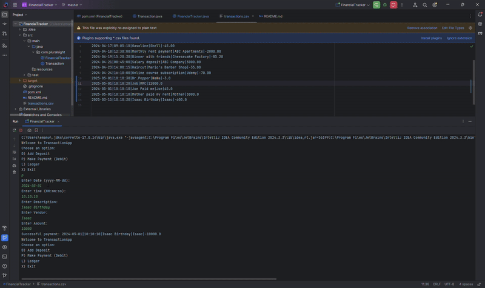

# Project Title

## Description of the Project
This project allows user to see transactions, create payments, and deposits. It also has a feature to where the user can search transactions and filter search to receive certain transactions.

## User Stories
- As a user, I want to be able to add a deposit, so that I can use funds to make payments.
- As a user, I want to be able to add a payment, so that I can make purchases.
- As a user, I want to be able to view my account statement, so I can keep track of funds.
- As a user, I want to be able to search my account using date, so I can see when funds were added or taken from my account.
- As a user, I want to be able to search my account using description, so that I can see what was the transaction for.
- As a user, I want to be able to search through transactions using vendor, so that I can see who gave or received funds to my account.
- As a user, I want to be able to search through transactions using amount, so that I can see how much money was added or withdrawn from my account.

## Setup

To run this console Application click the green play button that is next to main class

### Prerequisites

- IntelliJ IDEA: Ensure you have IntelliJ IDEA installed, which you can download from [here](https://www.jetbrains.com/idea/download/).
- Java SDK: Make sure Java SDK is installed and configured in IntelliJ.

### Running the Application in IntelliJ

Follow these steps to get your application running within IntelliJ IDEA:

1. Open IntelliJ IDEA.
2. Select "Open" and navigate to the directory where you cloned or downloaded the project.
3. After the project opens, wait for IntelliJ to index the files and set up the project.
4. Find the main class with the `public static void main(String[] args)` method.
5. Right-click on the file and select 'Run 'YourMainClassName.main()'' to start the application.

## Technologies Used

- Java: 17.
- GitHub projects for creating and finishing tickets.

## Demo

## Future Work
- Additional feature to be developed will allow user to search report using whatever parameter they would like.

## Resources

List resources such as tutorials, articles, or documentation that helped you during the project.

- https://ezgif.com/video-to-gif
- https://www.geeksforgeeks.org/date-class-java-examples/
- Workbook 3 - 1 - Mastering Java Fundamentals v2.2Y
- Workbook 3 - 3 - GitHub and Repository Management v6.1Y
- https://github.com/RayMaroun/yearup-spring-section-10-2025/blob/master/pluralsight/java-development/workbook-3/

## Thanks

Express gratitude towards those who provided help, guidance, or resources:

- Thank you to Raymond for continuous support and guidance.
- A special thanks to all teammates for their help and problem-solving skills.
 